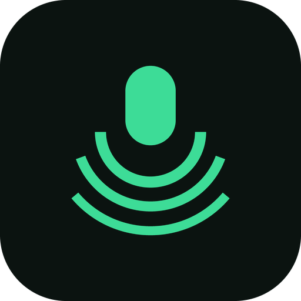

# Earshot

**Use your phone as your PC's microphone — over Wi-Fi.**



Free, open source, no ads, no account, no cloud. Nothing ever leaves your home network.

## Download

| | File | |
|---|---|---|
| 📱 **Phone** | [**earshot.apk**](https://github.com/MrMazlum/Earshot/releases/latest/download/earshot.apk) | Android. Sideload it — not on Play yet |
| 🪟 **Windows** | [**earshot-receiver-windows-x86_64.zip**](https://github.com/MrMazlum/Earshot/releases/latest/download/earshot-receiver-windows-x86_64.zip) | Also needs VB-Cable — free, once |
| 🐧 **Linux** | [**earshot-receiver-linux-x86_64.tar.gz**](https://github.com/MrMazlum/Earshot/releases/latest/download/earshot-receiver-linux-x86_64.tar.gz) | Nothing else to install |

## Quick start

### 🪟 Windows

1. **Install VB-Cable.** Free, once, three minutes — but there is a right file and three ways to
   pick the wrong one: **[read this first ↓](#installing-vb-cable-exactly-which-file)**
2. **Unzip Earshot and double-click `Earshot.exe`.** No window opens. A microphone icon appears next
   to the clock, and a notification shows your **nine-digit pairing code**
3. **On the phone:** install the APK, type the nine digits, press **Start**
   *(Android will warn you the developer is unknown — [that's expected ↓](#your-phone-will-warn-you))*
4. **In Discord**, pick **`CABLE Output`** as your microphone — **not** `CABLE Input`
   *([why it isn't just called "Earshot" ↓](#why-your-microphone-is-called-cable-output))*

### 🐧 Linux

1. **Extract and run `./earshot-tray`.** The pairing code is in the icon's menu
2. **On the phone:** install the APK, type the nine digits, press **Start**
3. **In Discord**, pick **Earshot** as your microphone

---

The tray icon is 🔵 **blue** while it waits for your phone and 🟢 **green** while your voice is
actually arriving. Grey means stopped, red means something needs you.

**Nothing arriving?** On Windows it is almost always the firewall —
**[the one-line fix ↓](#troubleshooting)**.

## What it is

```
   YOU SPEAK
       ↓
   📱 phone mic  →  noise removal  →  Wi-Fi  →  💻 PC  →  "microphone"  →  Discord
```

The app on your phone listens and sends; a small background program on your PC receives it and hands
it to Windows or Linux as an ordinary microphone. Discord, Steam, OBS and everything else just see "a
microphone" in their dropdown — they never know it's your phone.

<details>
<summary><b>Why bother?</b></summary>

Laptop microphones sound bad. They pick up the fan, the desk and your keyboard, and you're sitting
too far away from them.

Your phone is much better at this. It has several microphones and a chip whose whole job is removing
background noise — that's why you sound fine on a phone call in a noisy room.

But you can't easily use your phone as your PC's mic. Today people join the Discord call twice, once
from a second account on the phone, which causes echo and a mess of audio settings.

</details>

**Planned, not built yet:** the return direction, so the call's audio goes back to the phone and you
plug your headset into the **phone** instead — one device for both, no wires to the PC at all. Today
Earshot is a microphone only.

<br>

---

# The details

Everything below is here when you need it. You should not need it to get started.

## Installing VB-Cable, exactly which file

Windows will not let a program invent a microphone — that needs a driver signed by Microsoft — so
Earshot borrows one that somebody else already signed. This is the only awkward part of the whole
setup, and you do it once.

Go to **[vb-audio.com/Cable](https://vb-audio.com/Cable/)** and find the box titled
**"VB-CABLE Driver Pack"**. The file is `VBCABLE_Driver_Pack45.zip`, dated **2024**.

> ⚠️ **That page advertises five products at once.** Do **not** take *Hi-Fi Cable & ASIO Bridge* — it
> is dated **2014**, it sits near the top, and it reads like the safe established choice. It is a
> different product and it will not give you the device Earshot needs. Skip *VB-CABLE A+B* and
> *C+D* as well. You want the plain Driver Pack.

Extract the zip. There are **two** installers inside, and nothing in the zip says which is which:

| | |
|---|---|
| **`VBCABLE_Setup_x64.exe`** | **this one** — any PC from the last 15 years |
| `VBCABLE_Setup.exe` | only for 32-bit Windows |

**Right-click it → "Run as administrator".** Plain double-clicking looks like it worked and installs
nothing at all: Windows will not add a driver without administrator rights, and it does not tell you
that. Then click "Install Driver", accept the security prompt, and reboot if it asks.

The Windows zip contains a `START HERE.txt` with all of this, and the tray menu has *"How do I use
this?"* and *"It is not working..."* entries with the same advice — so you do not need this page open
while you do it.

## Your phone will warn you

The app is not on the Play Store and is not signed by a registered developer, so Android says so —
twice. The warning is correct, and it appears for every sideloaded app.

1. **While downloading**, Chrome may say the file "may be harmful". Choose **Download anyway** /
   **Keep**.
2. **While installing**, Play Protect says *"Blocked by Play Protect"* or *"unknown developer"*. The
   big obvious button is **Don't install**. Choose **More details → Install anyway**.

If you would rather not take our word for it, the source is right here and
`cd app && flutter build apk --release` produces the same thing.

## Why your microphone is called `CABLE Output`

Because it is VB-Audio's device, not ours. On Linux, Earshot creates its own input and names it
**Earshot**. On Windows it cannot: publishing an audio endpoint needs a kernel driver signed by
Microsoft, so Earshot plays into a cable somebody else already signed.

The two ends read backwards, which catches out everybody:

| | |
|---|---|
| **CABLE Input** | a *playback* device. Earshot plays into it, and finds it by itself |
| **CABLE Output** | a *recording* device. **This is the one you pick in Discord** |

**You can rename it.** Click the Earshot tray icon → *"Rename this input to Earshot..."*. It opens
the exact dialog for you and says which box to type in. Windows remembers the new name and every
application picks it up (Discord may need restarting first).

Earshot does not rename it for you on purpose: the name lives in `HKEY_LOCAL_MACHINE`, so writing it
would mean elevating to administrator in order to edit another vendor's driver settings — for a
cosmetic change you can make yourself in fifteen seconds.

## Troubleshooting

**The app says it's sending, the tray icon stays blue.**
On Windows this is almost always the firewall: it drops incoming UDP for a program with no rule, and
the prompt that would have asked you needs an administrator, so it is often never shown at all. The
tray's *"It is not working..."* entry has this, and the console receiver prints it after 25 seconds
of silence. In an Administrator PowerShell:

```powershell
New-NetFirewallRule -DisplayName Earshot -Direction Inbound -Protocol UDP -LocalPort 47811 -Action Allow -Profile Private -RemoteAddress LocalSubnet
```

Then check this network is set to **Private**, not Public, in Windows settings — Public turns on the
firewall's strictest profile, and the rule above deliberately does not apply there.

The last two switches matter. Without them the rule is permanent, applies on every network profile
and accepts from any source — so the next café Wi-Fi your laptop joins can reach a receiver that
[does not check who is sending to it](SECURITY.md). Scoped this way, the opening closes again when
you leave your own network.

On Linux, if you run a firewall, scope it the same way rather than opening the port outright:

```bash
sudo ufw allow from 192.168.0.0/16 to any port 47811 proto udp
```

That is the range home routers usually hand out. If your addresses start `10.` or `172.16`–`172.31`,
use `10.0.0.0/8` or `172.16.0.0/12` instead — the receiver prints the address it is on.

**Still nothing.** Guest Wi-Fi and "client isolation" block device-to-device traffic outright, and no
firewall rule will help. Turning on your phone's hotspot and joining the PC to it rules that out in a
minute.

**No code appears, just an address.** Your PC is on a network outside the private ranges, or on a
VPN. Type the address and port into the app instead.

**The code is for the wrong network.** A PC on both Ethernet and Wi-Fi gets a code for each; the
receiver lists them all. Use the one for the network your phone is on.

**Windows: the icon is green, but Discord hears silence.** You picked `CABLE Input` instead of
`CABLE Output`. If it is definitely the Output, check both ends of the cable are set to the same
format in Windows' Sound settings.

**Windows: the tray icon has disappeared.** Windows hides tray icons by default — click the `^`
arrow next to the clock, then drag the microphone icon out onto the taskbar so it stays.

**Windows: nothing happens when I double-click `Earshot.exe`.** It has no window by design; look next
to the clock. If it is not there either, run `earshot-console.bat` instead, which keeps a terminal
open and will say what went wrong.

## The pairing code

Your PC shows something like **335 618 795**. Type those nine digits into the app. One thing to type
instead of an IP address *and* a port number — and your network layout is not sitting on screen in
every screenshot and stream.

<details>
<summary><b>What the code is, and what it is not</b></summary>

**The code is your address in a friendlier coat, not encryption.** It is a reversible encoding, the
algorithm is in this repository, and anyone who wants the address back can have it. The receiver even
prints the address underneath the code, for the times the code doesn't work.

That's fine. It is a private address that means nothing outside your own network, and anyone already
on your network could list every device on it in about a second anyway.

What the code actually buys you is smaller, and real:

| | |
|---|---|
| Nothing to screenshot | your subnet doesn't end up in a stream or a support thread |
| Neighbouring machines look unrelated | nobody guesses the code for the PC next to yours |
| Typos are caught immediately | about 7 in 8 mistyped digits are rejected on the spot |

That last one matters more than it sounds. The alternative to "that code is not right" is a
thirty-second silent timeout — the worst error message a network app can give.

Codes cover the private address ranges and eight ports from the default. Anything else — and there
isn't much else — still works by typing the address, behind *"Type an address instead"* in the app.

</details>

## Why it feels instant

Voice chat is unusable if your words arrive late. So:

- **Wi-Fi, not Bluetooth.** Bluetooth's hands-free mode wrecks microphone quality — it's why you
  sound like a drive-thru speaker on a Bluetooth headset
- **Speed over perfection.** Audio lost on the way is skipped, never resent. Waiting for it would
  make you fall further and further behind
- **Small, fixed buffers**, and the delay they cost is on screen while it runs, in milliseconds

Compression is the gap: it currently sends raw audio at about 770 kbps. **Opus** — the same codec
Discord uses, at roughly 4 KB per second — is the next thing to land, and it is not in yet.

**Target: under 100 ms** from your mouth to the other person's ear. That will be *measured* and
published here, or not claimed at all. It has not been measured, so it is not claimed.

## The honest parts

- **Windows needs one extra free program** (VB-Cable) so the PC can treat the stream as a real
  microphone. It is closed-source, made by VB-Audio and not by us, and you install it yourself from
  their site — Earshot only detects it and links to it, and never downloads or runs anything on your
  behalf. Shipping our own would need a Windows driver signed by Microsoft, which needs a registered
  company and hundreds of euros a year. Linux needs nothing extra
- **It only works on your own network.** No cloud, no server, no account. That's deliberate — your
  microphone should not be reachable from the internet
- **Nothing is collected.** No analytics, no crash reports, no tracking. The code is public so you
  can check that yourself
- **The pairing code identifies a PC; it does not authenticate one.** Anyone already on your network
  can send audio to a receiver that is sitting idle. While a phone is actually streaming, packets
  from anywhere else are ignored until it stops — which makes cutting into a live feed a deliberate
  act rather than an accident, and is not the same as stopping it
- **The audio is not encrypted.** It crosses your own Wi-Fi as plain samples, so anyone who has your
  Wi-Fi password and cares to look can hear whatever your phone's microphone is picking up, for as
  long as the app is streaming. On a home network that may be a trade you are happy with; it is worth
  making on purpose rather than finding out later. Encryption is planned and is not written yet
- **The Android APK on the releases page is signed with the Android debug key**, whose password is
  a published constant. It is fine to sideload if you trust this repository, and it is not evidence
  that you should — `cd app && flutter build apk --release` gives you the same app signed by you

[SECURITY.md](SECURITY.md) has the full list of what Earshot does and does not promise, and how to
report a problem privately.

## What works today

| | Works | Not yet |
|---|---|---|
| 📱 **Android app** | records, sends over Wi-Fi, pairs with a nine-digit code | no discovery — the code is typed, not found |
| 💻 **PC receiver** | receives, survives loss and reordering, plays out or into a virtual mic | — |
| 🖱️ **PC app** | tray icon on both platforms: pairing code, start/stop, start-at-login — no terminal | no window, no level meter |
| 🐧 **Linux** | works, virtual microphone included (`--virtual-mic`) | — |
| 🪟 **Windows** | works — audio arrives, VB-Cable path, tray icon | the input is VB-Audio's `CABLE Output` unless you rename it |
| 🍎 **macOS** | nothing — never built, not in CI | not a priority. The code path exists: install BlackHole and use `--device` |

**Also missing:** Opus compression (so it currently uses ~770 kbps instead of ~40), the PC → phone
direction, automatic discovery, and encryption. Those are the next steps, in that order.

**"Works" here means one person, one phone, two PCs.** It has not been through anyone else's Wi-Fi,
router or sound card yet. If it breaks on yours, that is worth an issue — it is the kind of thing
nobody can find alone.

## Build from source

```bash
# terminal 1 — the PC side. Prints the pairing code to type into the app.
cd receiver && cargo run --release --bin earshot-receiver

# terminal 2 — a fake phone, so you can hear it working right now
cargo run --release --bin earshot-testsend -- --seconds 10
```

A 440 Hz tone should come out of your speakers, and the receiver should print a line a second saying
how much is buffered and how much was lost. To watch it cope with a bad network:

```bash
cargo run --release --bin earshot-testsend -- --loss 5 --jitter 25
```

With a real phone: `cd app && flutter build apk --release`, install it, type the pairing code, press
Start.

<details>
<summary><b>As an actual microphone, and without a terminal</b></summary>

```bash
cargo run --release --bin earshot-receiver -- --virtual-mic
```

**Earshot** now appears in Discord's, OBS's and Zoom's input list. Nothing comes out of the speakers
in this mode — the audio goes to the virtual device instead. It stays until you reboot or run
`--remove-virtual-mic`, so applications keep remembering your choice.

```bash
cargo run --release --bin earshot-tray -- --install
```

Puts a microphone icon in the system tray and starts it at every login — on Windows too, where the
same binary ships as `Earshot.exe`. Click it for the pairing code, whether the phone is connected,
and a start/stop switch. The icon changes when audio is arriving. `--uninstall` removes the login
item.

On GNOME this needs the AppIndicator extension — Ubuntu turns it on by default.

</details>

<details>
<summary><b>On Windows, from a terminal</b></summary>

```
earshot-receiver.exe --virtual-mic
```

`--list-devices` prints what it can play into, and `--device "<name>"` points it at a cable Earshot
doesn't recognise by name.

</details>

## Layout

| Folder | What's there |
|---|---|
| `app/` | the Android app — Flutter UI, Kotlin capture service |
| `receiver/` | the PC program, in Rust |
| `protocol/` | [the wire format, specified](protocol/README.md), and the pairing-code test vectors |
| `tools/` | development helpers |
| `docs/` | the security review this repo cleared before it was published |

## Contributing

Read [CONTRIBUTING.md](CONTRIBUTING.md) first — it is short, and most of it is about the audio thread
and about not committing your own IP address. Writing another client? Everything you need is in
[`protocol/README.md`](protocol/README.md).

Found a security problem? Please report it privately — see [SECURITY.md](SECURITY.md).

## Licence

GPL-3.0. Published after the security review recorded in
[`docs/pre-open-source-checklist.md`](docs/pre-open-source-checklist.md) — which is kept in the repo
rather than deleted, because what was checked is more useful to a reader than the fact that it was.
